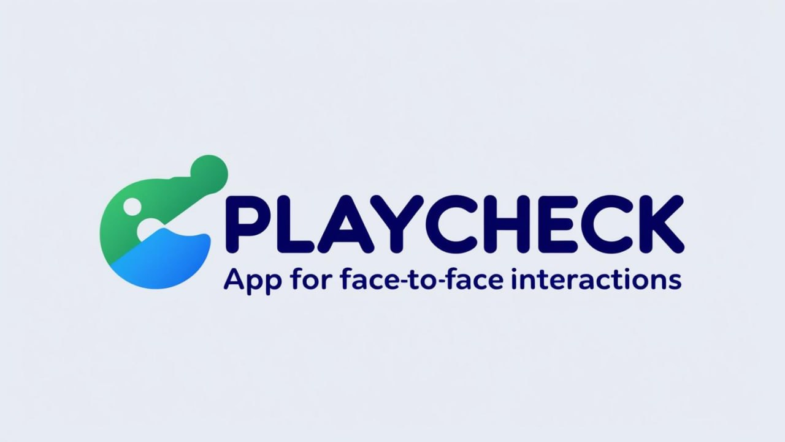

# PlayCheck:  The Real-World Verification Game with AI & ZKP!

  ## Overview

This application revolutionizes how we verify real-world events! PlayCheck is a gamified checking app where users participate in real-time "challenges" to confirm observations and facts about their surroundings.  Instead of betting, users contribute to a decentralized, AI-powered oracle, earning rewards for accurate and honest contributions. The app leverages Zero-Knowledge Proofs (ZKPs) for enhanced privacy and AI agents for robust verification, all secured by the power of blockchain.  Get ready to explore, observe, and earn!

## Features

*   **Challenge Creation & Verification:**  A user (the "Challenger") creates a real-world observation challenge.  The app, using AI, ensures the challenge is clear, objective, and verifiable before others ("Verifiers") can participate. Examples:
    *   "How many red cars pass this intersection in the next 10 minutes?"
    *   "Is the flag at the top of City Hall flying at half-mast?"
    *   "Is the coffee shop on Main Street currently open?"
    *   "Are there more than 5 people waiting at this bus stop right now?"
*   **Contribution & Staking (Gamified):** Verifiers contribute their observations, optionally staking a small amount of RLUSD to boost their potential rewards.  This incentivizes honest participation and discourages spam.  This is *not* betting; it's a reward mechanism for accurate contribution.
*   **AI-Powered Verification:**  AI agents analyze the data submitted by Verifiers (text descriptions, photos, audio clips). The AI acts as a preliminary filter, flagging potential discrepancies and assisting in consensus building.
*   **Zero-Knowledge Proof (ZKP) Validation:**  Verifiers submit their observations along with a ZKP.  This proof allows the system to confirm the *validity* of the observation (e.g., "the photo was taken at the specified location and time") *without* revealing the actual photo content to other Verifiers or the Challenger (preserving privacy).
*   **Consensus Mechanism:** The app uses a consensus mechanism (e.g., a majority-rules system with weighted voting based on Verifier reputation and stake) to determine the "ground truth" outcome of the challenge. The AI agent's analysis contributes to this consensus.
*   **Reward Distribution:** Verifiers who contributed to the consensus outcome receive rewards in RLUSD, proportional to their stake and the overall participation level.  The Challenger may also receive a small reward for creating a successful challenge.
*   **Reputation System:**  Verifiers build a reputation score based on their accuracy and participation.  Higher reputation unlocks access to more challenging and rewarding tasks, and potentially greater influence in the consensus mechanism.
*   **Blockchain Integration:**  Using RLUSD and XRP Ledger for transparent and secure transactions (reward payouts, staking).
*   **Ethical Observation:** All challenges must be ethical, respect privacy, and focus on verifiable, objective observations of the public environment.  No personal information should be collected or revealed without explicit consent.

## Architecture

Blockchain:

1.  **RLUSD:** Used as the stablecoin for rewards and optional staking.
2.  **XRP Ledger:**  Powers the secure and transparent transaction mechanism for reward distribution and staking.

AI Agents:

1.  **Challenge Validation Agent:**  Ensures challenges are clear, objective, and verifiable.
2.  **Data Analysis Agent:**  Analyzes submitted data (text, images, audio) to identify potential inconsistencies and assist in consensus building.  This agent is trained to detect common forms of manipulation or misinformation.
3.  **Fraud Detection Agent:** (Future Work) - An advanced AI agent focused on identifying sophisticated attempts to game the system.

Zero-Knowledge Proofs (ZKPs):

1.  **Privacy-Preserving Verification:**  ZKPs allow Verifiers to prove the validity of their observations without revealing the underlying data.
2.  **Location & Timestamp Verification:**  ZKPs can be used to prove that a photo or video was taken at a specific location and time, without revealing the raw data.
3.  **Data Integrity:** ZKPs ensure that the submitted data hasn't been tampered with.

Trusted Execution Environments (TEE) (Future Work):

1.  **Secure Data Processing:** TEES can be used to securely process sensitive data (e.g., images) within a protected environment, further enhancing privacy.
2.  **AI Agent Integrity:** TEES can ensure the integrity of the AI agents, preventing malicious modification.

## How It Works

1.  **Create a Challenge:**  A Challenger proposes a real-world observation challenge (e.g., "Count the number of blue bikes parked outside the library").
2.  **Challenge Validation:** The app (and potentially other users) review the challenge for clarity and feasibility.
3.  **Become a Verifier:**  Other users in the vicinity choose to become Verifiers.
4.  **Submit Observations & ZKPs:** Verifiers make their observations and submit them along with a ZKP that validates the data's integrity and context (e.g., location, time).
5.  **AI Analysis & Consensus:** The AI agents analyze the submissions, and the system uses a consensus mechanism to determine the "true" answer.
6.  **Earn Rewards:**  Verifiers who contributed to the consensus are rewarded with RLUSD.
7.  **Build Reputation:** Accurate and consistent contributions increase a Verifier's reputation score.

## Technologies Used

*   Blockchain: RLUSD, XRP Ledger
*   AI:  AI agents for challenge validation, data analysis, and fraud detection (future work). (Specify types like Computer Vision, NLP if known)
*   Zero-Knowledge Proofs (ZKP):  For privacy-preserving verification. (e.g., zk-SNARKs, zk-STARKs - specify if a particular type is planned)
*   Trusted Execution Environments (TEE) (Future Work)
*   Mobile Development Frameworks (e.g. React Native, Flutter - specify if you're using a cross-platform solution)

## Contributing

We welcome contributions! Please feel free to fork the repository and submit pull requests. Here's how you can help:

*   Report bugs or suggest features (especially around the incentive mechanisms and ZKP implementation).
*   Contribute code or improvements (AI development, blockchain integration, UI/UX).
*   Help with documentation (especially explaining the ZKP aspects in a user-friendly way).
*   Help design robust consensus and reputation systems.
